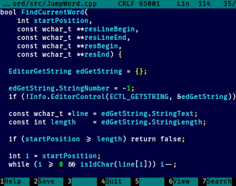

About
=====

The far2l plugin that searches the word under the cursor below or above the current location. This is quite useful for
quick navigation in sources. The demo is below:



Key macros
==========

In addition you can install <kbd>Ctrl</kbd> + <kbd>Alt</kbd> + <kbd>↓</kbd>, <kbd>Ctrl</kbd> + <kbd>Alt</kbd> +
<kbd>↑</kbd>, <kbd>Ctrl</kbd> + <kbd>Shift</kbd> + <kbd>↓</kbd> and <kbd>Ctrl</kbd> + <kbd>Shift</kbd> +
<kbd>↑</kbd> keyboard shortcuts. To do that, add the following sections to `~/.config/far2l/settings/key_macros.ini`:

```ini
[KeyMacros/Editor/CtrlAltDown]
DisableOutput=0x0
Sequence=F11 j 2

[KeyMacros/Editor/CtrlAltUp]
DisableOutput=0x0
Sequence=F11 j 1

[KeyMacros/Editor/CtrlShiftDown]
DisableOutput=0x0
Sequence=F11 j 2

[KeyMacros/Editor/CtrlShiftUp]
DisableOutput=0x0
Sequence=F11 j 1
```

Unit tests
==========

The word-matching logic (`src/JumpWordCore.hpp`) is independent of the FAR SDK and is covered by standalone unit
tests in `tests/test_jumpword.cpp`, which build and run without a far2l checkout:

```
c++ -std=c++17 -o test_jumpword tests/test_jumpword.cpp && ./test_jumpword
```

or via CMake:

```
cd tests && cmake -B build && cmake --build build && ctest --test-dir build
```
